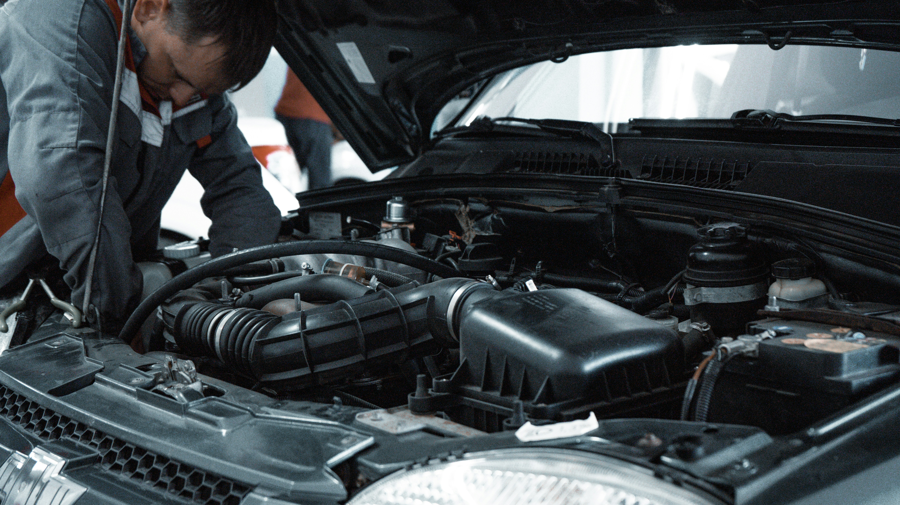
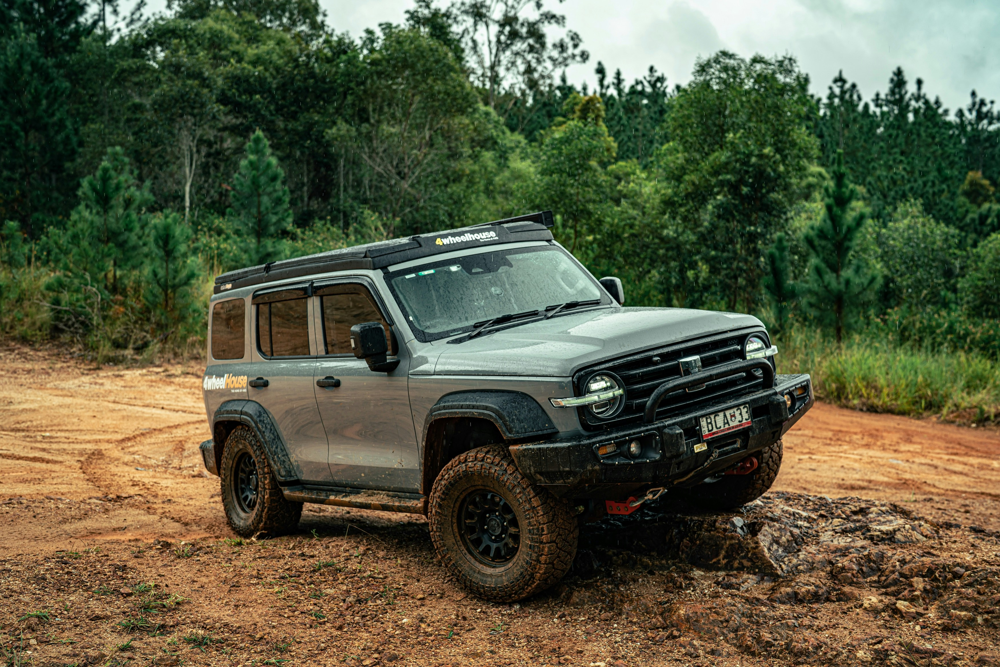

# haval

Next.js marketing and lead-capture site for a South African automotive dealership group, focused on vehicle discovery, brand presentation, and inbound contact flow.

## What it does
- Landing experience with high-impact hero carousel and branded visual sections.
- Dealership services funnel (new vehicles, pre-owned, service/parts, finance).
- Contact and call-to-action paths built directly into page flow.
- Performance and analytics instrumentation via Vercel Analytics/Speed Insights.

## Stack
- Next.js 16 (App Router), React 19, TypeScript
- Tailwind CSS 4
- Framer Motion and React Three Fiber for rich interactions/3D presentation
- Resend for email workflows

## Local development
```bash
npm install
npm run dev
```

App runs on `http://localhost:3000` by default.

Production commands:
```bash
npm run build
npm run start
```

## Project shape
- `src/app/` routes and page composition
- `src/components/` reusable UI and section blocks
- `public/` static media, brand assets, hero imagery

## Demo



## Practical next improvements
- Add structured SEO metadata per vehicle and service page.
- Add form submission observability (delivery status + retry visibility).
- Add Playwright smoke tests for primary conversion paths.
